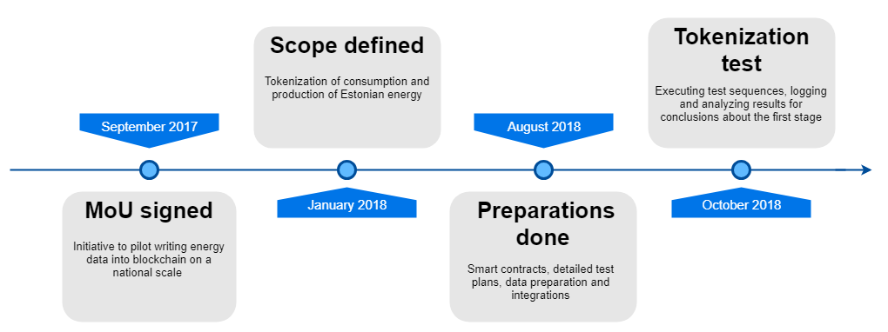

# First stage of the Elering pilot
The Elering pilot conceptually started in September 2017, when the Memorandum of Understanding was signed formalizing the initiative to pilot in loading national scale energy data into a public blockchain. By January 2018 it was clear that the scope shall be tokenization of electricity consumption and production data. To reach that goal, Smart Contracts were written, detailed concepts and test plans were composed, data prepared and necessary integrations finalized. In October 2018 the test itself was finally concluded.

# Preparing the concept and details
The concept of the first stage of the test was prepared on the basis of having the production and consumption data as granular as possible without the risk of not complying to the GDPR regulation. The goal of the first stage of the pilot was to generate Energy Smart Tokens to represent energy ownership and match consumption with production. The data used was the entire set of production and consumption data of Estonia received from the Estonian TSO Elering for the year 2017. 

In detailed concept preparation we had a number of assumptions that had to be addressed. Storing the data on blockchain for fixing the ownership was a necessity, also green energy tokens and “other” energy tokens were going to be created for simulating different energy sources in a more generic form as production details were limited. That meant that in reality we were going to generate 3 different contracts:
1. The first one was the contract with all the consumption and production information;
1. The second one was for fixing the amount of green energy used by the consumers. This is recognized in the context of current test as “green energy token”.
1. The third one was the one where we fixed what kind and how much was consumed from the “other” sources. For simplicity and due to lack of easily accessible granular data, this was decided to be recognized as “unknown energy token”. “Unknown” because it is not monitored on hourly basis in a publicly available format of how much and what is used. For example the big oil-shale plants in Estonia also have statistically certain “greenness” rate on them, as they use some amount of renewable fuel for achieving certain benefits. 

The concept test plan had to be prepared also and the contracts had to be revisited for accommodating the needed custom logics. Wallets had to be generated per every consumer participating in the market.

Regarding the testing plan then for the research and optimization analysis it was clear that at least one part of the test had to take place on the main network. This was decided to be the first contract with all of the consumption and production data. Other contracts were decided to be loaded into the ETH test network, as the gas price and limit issues were not the ones that would give us a lot of extra value at this point. What was of value is the comparison of outcomes with compressed data sets and uncompressed data sets. Unlike for the ETH main network, for ETH test network we didn’t optimize the data sets much, because we wanted to have referrable results with the full data sets within each network.

Hypothesis that were set before the tests: 
- During bulk uploading of data WePower will utilize more than 70% of each block. 
- Median wait time of each block/transaction supports feasibility of real-time data exchange. Which gas price level supports real-time data exchange?
- Is the gas price affected because WePower activities take majority of the resources.
- During certain time periods it is remarkably cheaper to upload the data.
- We can upload 1 year worth of data into blockchain faster than 1 year.

# Preparing the specification
The specification was needed for the contract amendments based on the outcomes of the conceptual needs.

Energy Smart Contract (ESC) is a technical term that refers to the entity that defines and facilitates Energy Tokens implementation process. Energy Token is a part of ESC that represents the ownerships of rights and obligations of the energy token holder under a particular power purchase agreement. Wallet is an entity that aggregates the ownerships of Energy Tokens in one or many ESCs.
- ESC contains energy tokens
- Each token refers to specific wallet
- Wallet contains references to ESCs
- Platform has a capability to issue command to ESC based on business logic

ERC20 and ERC721 token standards have their limitations for enabling the specific transactions needed by WePower. The reasoning for deviating from the well known token standards will be elaborated further in future analysis documents where we dig deeper into the wallet structures, contract versioning and log chaining alongside with energy tokens and energy smart contracts.

# Analysing the dataset
Our analysis is based on real world electricity production and consumption data. We worked with both renewable and non-renewable energy production data. In Estonia the main source of renewable energy is wind. In order to retrieve the data from Elering we integrated to Elering’s Estfeed data exchange platform. Estfeed platform facilitates secure and authorized access to energy (e.g. electricity and gas) meter consumption data by enabling end consumers, scattered producers and network operators to choose who to share their data with via the online platform e-Elering. In addition, public energy data can also be received, e.g. electricity prices or weather information through the platform.

## Data preparation steps
### Analyzing data points
The initial plan was to create the dataset based on one year’s electricity consumption of 700 000 households in Estonia. This would have meant roughly:
$$700,000 \text{ households} \times 365 \text{ days} \times 24 \text{ readings a day} = 6,132,000,000 \text{ data points}$$

To calculate the time needed for the test period, we have to consider that average block time on Ethereum main network is 15 seconds (same on test networks). That is the absolute best-case scenario when we would additionally assume that we can store 200 data points per block to the contract. In real world other people are also utilizing the blocks or WePower has to always pay the higher gas price to get the full capacity of each block.

The calculation for the time needed was based on the following formula:
$$\frac{ \text{Count of data points}}{ \text{Data points per block}} \times \text{Seconds per block}$$

With the full set of granularly separated data points it would have meant that simply storing the data would have taken: $\frac{6,132,000,000 \text{ data points}}{200 \text{ data points per block}} \times 15 \text{ seconds} \approx 5,300 \text{ days}$ which is roughly 14 years. Considering the concerns for current blockchain performance and WePower’s timeline, this was not feasible amount of data points for the test.

### Analyzing gas cost
Additionally, gas cost had to be calculated considering 6,132 billion data points with idealistic 200 data points per block, estimating to $6,132,000,000 \div 200 \approx 30.7$ million transactions. Considering gas cost per stored data point that would have required $30,700,000 \times 21,000 = 644,700,000,000$ gas limit, estimating to 5,472,810,000,000 Gwei at 8.5 Gwei gas price level, which can be calculated at any time with the current prices.

For storing of those data points $6,132,000,000 \times 20 000 \approx 122,640,000,000,000$ gas limit, estimating to 1,042,440,000,000,000 Gwei at 8.5 Gwei price level.  At the time of our calculations, this would have amounted to a cost of 1,042,440 ETH + 5,472 ETH, which was at the time of calculations respectively 208.5MEUR + 1.1MEUR = 209.6MEUR.

Obviously that kind of time frame and cost level is not something we would want to run our test on. Therefore alternative approaches and additional optimizations had to be considered. We could compress the data or optimize the dataset so that the amount of data points would be reduced.
